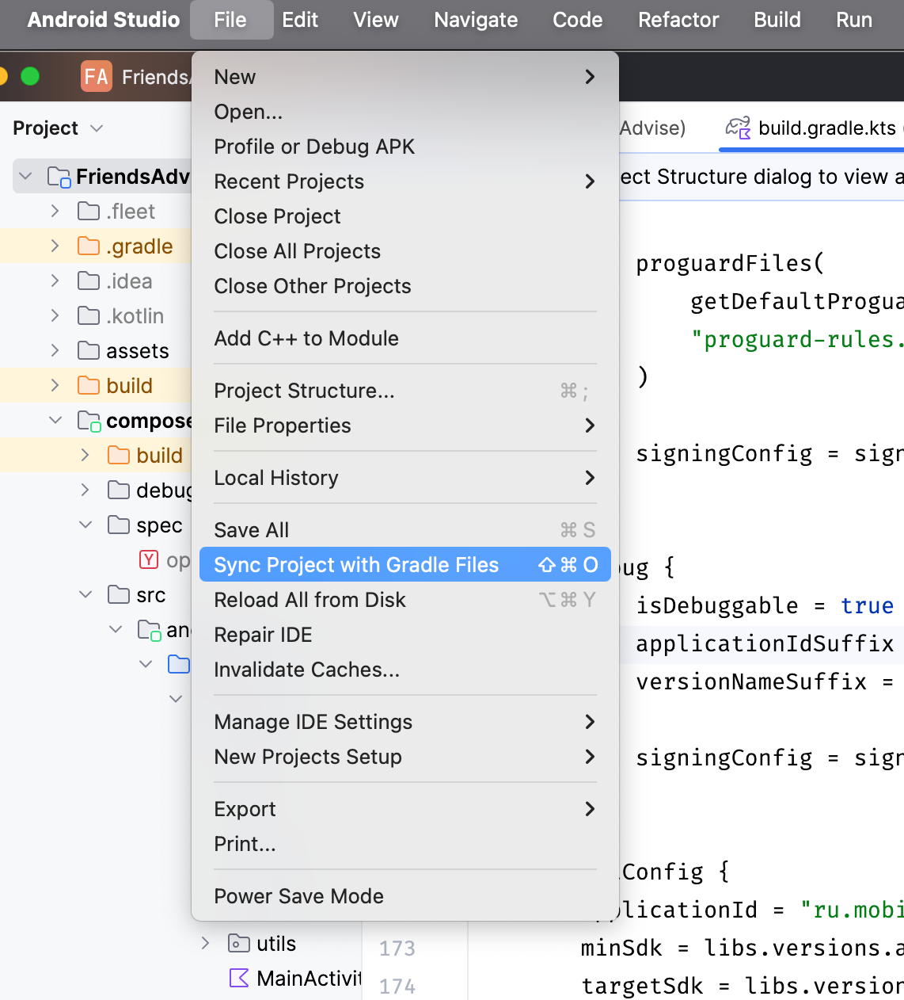
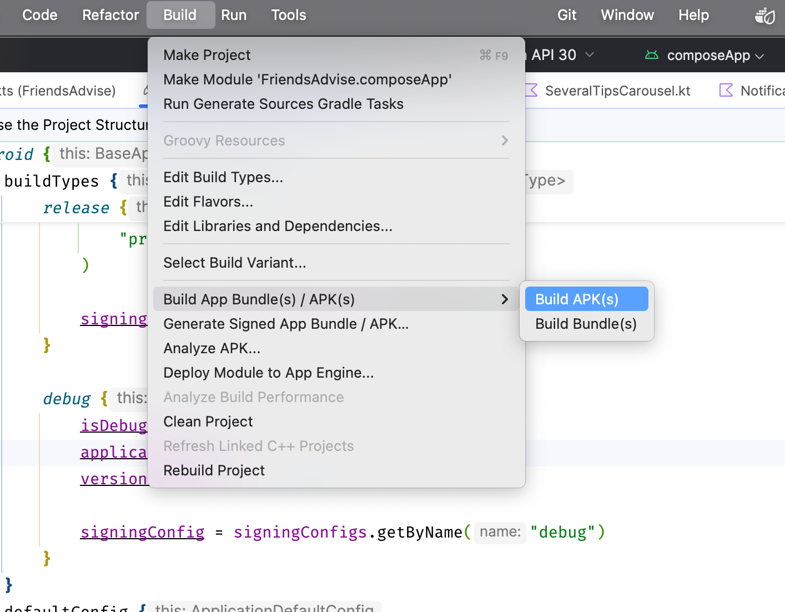

# Пет-проект GitHub Viewer

<p align="center">
  
</p>

<p align="center">
  <a href="https://github.com/stakancheck/GitHubViewerPet/actions/workflows/build.yml">
    
  </a>
  <a href="https://opensource.org/licenses/Apache-2.0">
    
  </a>
  <a href="https://github.com/stakancheck/GitHubViewerPet/issues">
    
  </a>
  <a href="https://github.com/stakancheck/GitHubViewerPet/network">
    
  </a>
  <a href="https://github.com/stakancheck/GitHubViewerPet/stargazers">
    
  </a>
</p>

## 🔥 Описание
GitHub Viewer - это приложение для просмотра репозиториев и профилей пользователей на GitHub. Оно позволяет легко находить и просматривать информацию о проектах и разработчиках.

## Особенности выполненного проекта
- **✅ Непрерывный поиск**: поддержка поиска при печати и обновления выдачи. Оптимизированы пропуски ввода и прочее.
- **✅ Подгрузка ленты выдачи**: реализована пагинация поисковой выдачи, доступно больше результатов, чем при одном запросе к API.
- **✅ Экраны ошибок**: разработана удобная система менеджемента ошибок. С разных источников приложения можно собирать разные типы ошибок и выводить в удобном формате с локализацией.
- **✅ Single Activity**: одна рабочая `Activity` и навигация от Jetpack.
- **✅ MVVM**: соотвествие паттерну `MVVM`.
- **✅ Clean Arch**: соблюдены принципы Clean Architecture, в проекте выделены слои для работы с данными, операций и представления. Проект можно легко разделить на модули (не сделано, так как маленький).
- **✅ Анимации и user-friendly интерфейс**: Реализованы lottie анимации, shimmer эффекты с подходом skeleton при загрузке данных. Поддержана темная и светлая тема приложения, все ориентации экрана. 

## Инструкция для сборки проекта

### Шаг 1: Клонирование репозитория

Сначала клонируйте репозиторий проекта на ваш локальный компьютер:

```sh
git clone https://github.com/stakancheck/GitHubViewerPet
cd GitHubViewerPet
```

### Шаг 2: Установка необходимых инструментов

Убедитесь, что у вас установлены следующие инструменты:

- [Android Studio](https://developer.android.com/studio?hl=ru)
- [JDK 11](https://www.oracle.com/java/technologies/javase/jdk11-archive-downloads.html)
- [Gradle](https://gradle.org/install/)

### Шаг 3: Добавление файла подписей

Для сборки проекта вам потребуется файл подписей `keystore.jks` и файл
свойств `keystore.properties`. Эти файлы должны быть добавлены в директорию `signing`.

1. Создайте директорию signing в корне проекта, если она еще не существует:
   `mkdir signing`

2. Добавьте файл `keystore.jks` в директорию `signing`.
3. Убедитесь в наличии файла `keystore.properties`.
4. Создайте ключи подписи в `keystore.jks` в `signing`.

Его формат:
```properties
storePassword=<smth>
keyPasswordDebug=<smth>
keyAliasDebug=key-debug
keyPasswordRelease=<smth>
keyAliasRelease=key-release
```

5. Также добавьте секретные файлы `secrets.properties` в корень проекта. Там укажите ваш токен GitHub.

```properties
githubApiToken=<YOUR_TOKEN>
```

### Шаг 4: Сборка проекта с помощью командной строки

Для сборки проекта с помощью командной строки выполните следующие команды:

1. Перейдите в директорию проекта:
   `cd /path/to/GitHubViewerPet`
2. Выполните команду для сборки проекта:
   `./gradlew assembleRelease`

> Эта команда создаст APK-файл для релизной сборки в директории `build/outputs/apk/release`.

### Шаг 5: Сборка проекта в Android Studio

1. Откройте Android Studio и выберите "Open an existing project".

2. Выберите директорию проекта GitHubViewerPet и нажмите "OK".

3. Убедитесь, что Android Studio успешно синхронизировала проект. Если нет, нажмите "Sync Project
   with Gradle Files".



4. Откройте меню "Build" и выберите "Build Bundle(s) / APK(s)" -> "Build APK(s)".



5. Дождитесь завершения сборки. После завершения сборки вы увидите уведомление с ссылкой на
   APK-файл.


## Вклад
Если вы хотите внести вклад в проект, пожалуйста, создайте форк репозитория и отправьте pull request. Мы приветствуем любые улучшения и исправления.

## Контакты автора
**✉️ Рабочая почта**: [a.sukhanov.work@gmail.com](mailto:a.sukhanov.work@gmail.com)
**💬 Telegram**: [@stakancheck_work](https://t.me/stakancheck_work)

## Лицензия
Этот проект лицензирован под лицензией **Apache License**. Подробности можно найти в файле [LICENSE.md](LICENSE.md).
